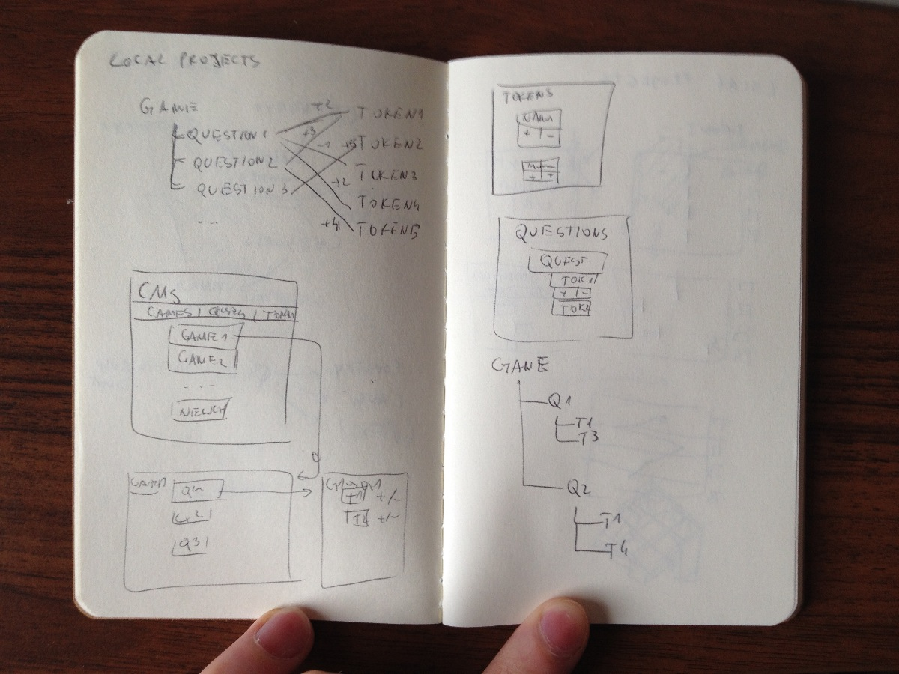
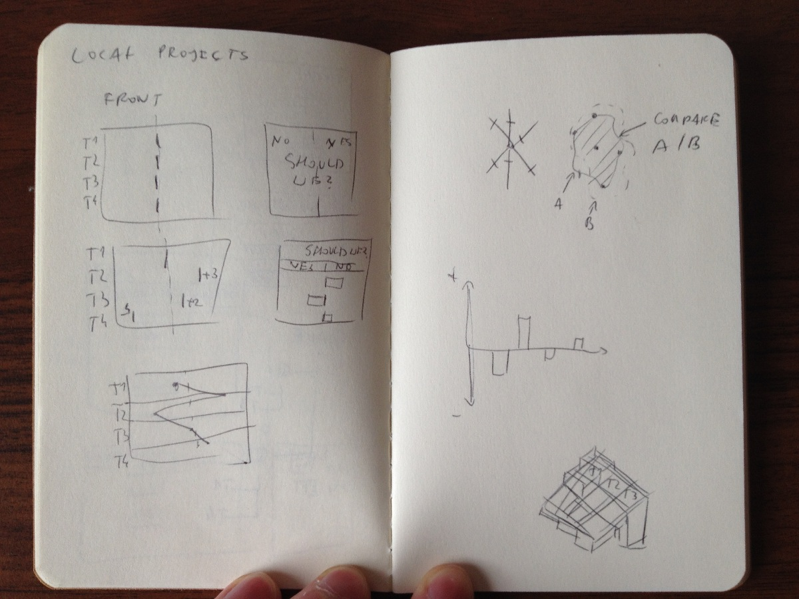

#Preparations

I started with wrapping my head around the brief, trying to sketch connections between games, questions and tokens. 
I came to conclusion, that both tokens, and questions should be available while making differnet games (eg. game A might use question Q3, and game B might use this question as well). 
Questions are always connected to the same tokens, so question Q3 always uses tokens T1, T3, and T4; this question can be used in different games, but will always have the same impact on the same tokens.

#Code overview

I decided to build this project as web application, using node.js and mongodb for backend, and Backbone for CMS and frontend.
For downloading libraries, running and building project I used grunt, with three simple tasks:

- `build` - to download all assets using bower, and copy them in right places
- `run` - to run app locally, starting nodemon, mongod, index.tpl processing (to generate index.html), and jshint
- `heroku` - task run when deploying on heroku, using special buildpack: https://github.com/mbuchetics/heroku-buildpack-nodejs-grunt.git

Frontend code is written using require.js for handling dependencies and view templates in ejs.

#Backend & CMS

After sketching some early ideas for CMS, I quickly wrote simple CRUD backend in node.js and mongodb, I decided on trying to move all important logic to frontend in Backbone.js, so backend should only serve, and respond to API requests, and server static files (html, css and js).
In half an hour I had basic CRUD implementation working on node, and started preparing files for writing CMS.

Building CMS took me more time than I thought it would, I got cought up in trying to fix Backbone.js subviews problems (including re-rendering on collection changes), and making CMS persistent. Still, sometimes after adding new question to the game, question impacts on tokens are not saved, refreshing page in browser fixes this. Finally after day of fighting with Backbone, CMS was functional.

I was trying to build it from simplest modules, starting from adding, editing, and removing tokens on separate view - http://localprojects-rpg.herokuapp.com/#cms/token

Then moving to editing all possible questions - http://localprojects-rpg.herokuapp.com/#cms/question - and later adding token views as subviews

And finishg on bringin it all together to create and edit a game - http://localprojects-rpg.herokuapp.com/#cms/game

#Frontend

I was most interested in working on frontend for this task. While taking breaks from fighting with CMS code, I was thinking of, and sketching ideas for the visualization.
It started from idea to draw polyline, that morphes on incoming responses, but I though that might be to literal, and boring to look at. Later, I was briefly thinkging on simple bar charts, but this would be even more boring. Finally, I settled on using something between radar chart, and 2d "blob", that deformes on incoming answers. The idea being, you should try to answer questions in a way, that make all tokens stay at relatively the same levels (blob staying in shape resembling circle). The game shows that you are answers are never fully balanced, and it's very hard to not fall to extremes.

I think this visualization, might be very interesting to show as comparision between different players, drawing it in a matrix, and allowing users to overlay their "blob" with others, showing differences and similarities at the end.

#Future works

This projects is far from complete, and should be looked at as nothing more than a prototype. If I were to work more on it I would start from fixing bug with adding questions in game cms, when impact on tokens isn't saved until page refresh. Then I would spend more time on frontend, add better graphics, make it responsive, and resizable (now, after window resize, page should be refreshed). I would work on bringing simple user comparision module (comparing "blobs" from different game outcomes). Finally, if I was satisfied with frontned, I would come back to backend, add some code to keep DB clean (now, after removing token, reference to it isn't removed from question), and add some nicer CSS for CMS.
